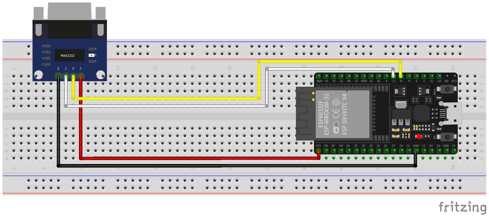

# ESPHome Luxtronik V1
> [!NOTE]
> This is the German version, for the English version, scroll down or click [here](#esphome-luxtronik-v1-english).

Luxtronik V1 ist eine ESPHome-Komponente zur Erstellung einer ESP-Firmware, die die Integration eines Luxtronik V1 Heizungssteuergeräts in das Smart Home ermöglicht. Die Komponente ist primär für die Einbindung in Home Assistant gedacht, aber über MQTT kann auch eine Integration mit einer alternativen Hausautomatisierungs-Software realisiert werden. Die Luxtronik Heizungsregelung in der Version 1 (V1) verfügt nicht über eine Netzwerkschnittstelle, sondern stellt lediglich eine RS-232-Schnittstelle zur Verfügung. Daher ist ein Mikrocontroller als Gateway zwischen Heizungssteuergerät und Netzwerk notwendig.

Dieses Projekt wurde stark von der [Luxtronik V1 ESPHome-Komponente](https://github.com/CBrosius/luxtronik_v1) von [CBrosius](https://github.com/CBrosius) inspiriert. Vielen Dank an CBrosius für die großartige Arbeit, die mir sehr geholfen hat, die Luxtronik-Schnittstelle und die Arbeitsweise von ESPHome-Komponenten zu verstehen.

- [Haftungsausschluss](#haftungsausschluss)
- [Lizenz](LICENSE)
- [Hardware-Aufbau](#hardware-aufbau)
- [Software-Konfiguration](#software-konfiguration)
  - [Luxtronik-Komponente](#luxtronik-komponente)
  - [UART-Komponente](#uart-komponente)
  - [Time-Komponente](#time-komponente)
  - [API/MQTT-Komponente](#apimqtt-komponente)
  - [WiFi-Komponente](#wifi-komponente)
  - [Sensoren](#sensoren)
    - [Numerische Sensoren](#numerische-sensoren)
    - [Binäre Sensoren](#binäre-sensoren)
    - [Textsensoren](#textsensoren)
  - [Aktoren](#aktoren)
  - [Aktionen](#aktionen)
- [Luxtronik-Konfiguration](#luxtronik-konfiguration)
- [Hilfe/Unterstützung](SUPPORT.md)
- [Mitwirkung](CONTRIBUTING.md)
- [Bekannte Probleme](https://github.com/jensrossbach/esphome-luxtronik-v1/issues?q=is%3Aissue+is%3Aopen+label%3A%22known+issue%22)

## Haftungsausschluss
**DIESE SOFTWARE UND DEREN AUTOR STEHEN IN KEINER VERBINDUNG ZU AIT / ALPHA INNOTEC.**

**DIE SOFTWARE (EINSCHLIEßLICH DER DOKUMENTATION MIT HARDWARE BEISPIEL-AUFBAUTEN) WIRD OHNE MÄNGELGEWÄHR UND OHNE JEGLICHE AUSDRÜCKLICHE ODER STILLSCHWEIGENDE GEWÄHRLEISTUNG, EINSCHLIEẞLICH, ABER NICHT BESCHRÄNKT AUF DIE GEWÄHRLEISTUNG DER MARKTGÄNGIGKEIT, DER EIGNUNG FÜR EINEN BESTIMMTEN ZWECK UND DER NICHTVERLETZUNG VON RECHTEN DRITTER, ZUR VERFÜGUNG GESTELLT. DIE AUTOREN ODER URHEBERRECHTSINHABER SIND IN KEINEM FALL HAFTBAR FÜR ANSPRÜCHE, SCHÄDEN ODER ANDERE VERPFLICHTUNGEN, OB IN EINER VERTRAGS- ODER HAFTUNGSKLAGE, EINER UNERLAUBTEN HANDLUNG ODER ANDERWEITIG, DIE SICH AUS ODER IN VERBINDUNG MIT DER SOFTWARE ODER DER NUTZUNG ODER ANDEREN GESCHÄFTEN MIT DER SOFTWARE ERGEBEN.**

## Hardware-Aufbau
Obwohl sich dieses Projekt hauptsächlich auf die Software-Implementierung konzentriert, habe ich auch einen möglichen Hardware-Aufbau dokumentiert. Dabei gibt es verschiedenen Möglichkeiten für den Aufbau, insbesondere in Hinblick auf den verwendeten Mikrocontroller (z.B. ESP8266 oder ESP32) und die Art und Weise, wie der Mikrocontroller mit dem Luxtronik Heizungssteuergerät verbunden wird.

> [!TIP]
> Grundsätzlich kann sowohl ein ESP8266 als auch ein ESP32 verwendet werden. Letzterer ist dabei besser geeignet, da er über mehrere Hardware-UARTs verfügt. Der ESP8266 verfügt dagegen nur über einen einzigen bidirektionalen Hardware-UART, der standardmäßig für das Logging über USB verwendet wird. Bei Verwendung eines ESP8266 muss man daher entweder auf das USB-Logging verzichten oder Software-UART verwenden (welches unzuverlässiger ist).

Der ESP-Mikrocontroller kann aufgrund der unterschiedlichen Spannungspegel nicht direkt an die RS-232-Schnittstelle des Luxtronik Heizungssteuergeräts angeschlossen werden. Stattdessen wird ein MAX3232-IC benötigt, um zwischen den unterschiedlichen Spannungspegeln auf Luxtronik- und Mikrocontroller-Seite zu konvertieren. Es gibt fertige Seriell-zu-TTL Konvertierungsmodulplatinen, die mit einem MAX3232-IC und einem DE-9 (auch D-Sub 9) Stecker ausgestattet sind. Auf der RS-232-Seite haben diese Module einen (meist weiblichen) DE-9-Stecker (an dem aber nur GND, RX und TX verbunden sind) und auf der TTL-Seite haben sie 4 Pins - VCC und GND für die Stromversorgung des Chips sowie RX und TX für die Datenübertragung. Diese Pins müssen mit den entsprechenden Pins des Mikrocontrollers verbunden werden. Der folgende Steckplatinen-Schaltplan zeigt ein Beispiel für einen Versuchsaufbau mit einem ESP32 NodeMCU Entwicklungsboard als Mikrocontroller.

> [!IMPORTANT]
> Verbinde den VCC-Pin mit dem **3V3-Pin** des ESP-Mikrocontrollers und **nicht** mit dem 5V-Pin. Dadurch wird sichergestellt, dass die RX- und TX-Pins ebenfalls einen Spannungspegel von 3,3V haben und die GPIO-Pins des Mikrocontrollers nicht beschädigt werden.



Normalerweise möchte man den Mikrocontroller außerhalb des Wärmepumpengehäuses platzieren, um einen besseren Wi-Fi-Empfang und eine einfachere Wartung zu ermöglichen. Es gibt zwei Möglichkeiten, wo die „lange“ Verkabelung zwischen dem Mikrocontroller-Aufbau und der Luxtronik platziert werden kann:

1. Serielles Kabel (fertig oder selbst gebaut), das zwischen dem MAX3232-Modul und der RS-232-Schnittstelle der Luxtronik angeschlossen wird
2. 4-adriges Kabel zwischen dem Mikrocontroller und dem MAX3232-Modul (letzteres wird direkt an die RS-232-Schnittstelle der Luxtronik angeschlossen)

Die meisten im Internet beschriebenen Aufbauten verwenden Option 1, aber ich habe mich in meinem Fall für Option 2 entschieden. Als Kabel habe ich ein handelsübliches 4-adriges Telefonverlegekabel verwendet. Diese Kabel haben zwei verdrillte Adernpaare (rot + schwarz und weiß + gelb). Die roten und schwarzen Adern sind prädestiniert für VCC bzw. GND. Ich habe dann gelb für RX und weiß für TX gewählt (dieselbe Farbgebung wie im Schaltplan). Die Adern haben jeweils einen Durchmesser von 0,6 mm, sodass der Spannungsabfall bei 3,3V und der sehr geringen Stromstärke bei einer Kabellänge von 2-4 Metern vernachlässigbar ist.

Warum habe ich mich für Option 2 entschieden? Der Grund war, dass fertige serielle Kabel heutzutage schwer zu bekommen und teuer sind und - der wichtigere Grund - die großen DE-9-Steckerenden nicht durch die kleinen Durchlässe im Gehäuse der Wärmepumpe passen. Außerdem wollte ich mir kein eigenes Kabel bauen, denn auch DE-9-Stecker sind schwer zu bekommen und teuer. Für Option 2 habe ich die Drähte an einem Ende des Kabels direkt an die TTL-Pins der MAX3232-Modulplatine gelötet und diese dann direkt an die Luxtronik RS-232-Schnittstelle angeschlossen (mit einem kleinen Nullmodem-Adapter dazwischen, siehe Tipp unten). Für den Mikrocontroller-Aufbau habe ich Buchsenleisten sowie Leiterplatten-Schraubklemmenblöcke auf eine Lochrasterplatine gelötet und die entsprechenden Pins angeschlossen. An die Buchsenleisten habe ich eine ESP32 NodeMCU-Entwicklungsplatine angeschlossen und konnte dann die Drähte des Telefonkabels einfach an die Schraubklemmen anschließen, nachdem ich das Kabel durch die Durchlässe des Wärmepumpengehäuses geführt hatte.

> [!TIP]
> Die meisten Quellen im Internet geben an, dass das serielle Kabel zur Verbindung des Empfängers mit der Luxtronik-Heizungssteuerung ein Kabel mit einer 1:1-Belegung der RX- und TX-Pins sein muss. Dies scheint jedoch von der seriellen Schnittstelle abzuhängen, die auf der Empfängerseite verwendet wird. In meinem Fall musste ich einen Nullmodem-Adapter verwenden, der die RX- und TX-Pins vertauscht, um das Ganze zum Laufen zu bringen.

Es gibt bereits ähnliche Projekte zum Auslesen der seriellen Schnittstelle des Luxtronik V1 Heizungssteuergerätes. Diese Projekte haben gute Dokumentationen der erforderlichen Hardware-Einrichtung, also schaue dir bitte auch diese hilfreichen Ressourcen im Internet an:

- https://github.com/CBrosius/luxtronik_v1
- https://wiki.fhem.de/wiki/Luxtronik_1_in_FHEM (nicht ESPHome-basiert)

## Software-Konfiguration
Um eine ESPHome-Firmware zu erstellen, muss eine YAML-basierte Konfigurationsdatei erstellt werden. Du kannst die in diesem Repository bereitgestellte [Beispielkonfigurationsdatei](example_config/luxtronik_lwc.yaml) als Ausgangspunkt verwenden und sie an deine Bedürfnisse anpassen.

Prinzipiell gibt es zwei Möglichkeiten, die ESPHome-Firmware zu bauen:

1. [Über Home Assistant mit dem ESPHome Device Compiler Add-on](https://www.esphome.io/guides/getting_started_hassio)
2. [Über die Kommandozeile mit dem ESPHome Python-Paket](https://www.esphome.io/guides/getting_started_command_line)

Für welche Methode du dich entscheiden solltest, hängt davon ab, wie vertraut du mit ESPHome bist und ob du lieber mit einer grafischen Benutzeroberfläche oder mit der Kommandozeile arbeitest. Außerdem könnte die Leistungsfähigkeit des Hosts, auf dem du die Firmware baust, eine Rolle spielen, um den Vorgang zu beschleunigen.

> [!NOTE]
> Es ist **nicht** nötig, dieses Repository zu kopieren ("forken") und die Anpassungen an der Beispielkonfiguration im kopierten Repository vorzunehmen. Stattdessen reicht es aus, die Beispielkonfiguration lokal zu speichern und anzupassen oder die angepasste Konfiguration auf deinem Home Assistant Host abzulegen (sollte die Erstellung der ESPHome-Firmware mithilfe des ESPHome Device Compiler Add-ons erwünscht sein).

Die folgenden Abschnitte beschreiben die wichtigsten Komponenten, die in der Firmware-Konfigurationsdatei enthalten sind.

### Luxtronik-Komponente
Die Komponente Luxtronik-V1 ist unabdingbar und muss hinzugefügt werden, um ihre Sensoren zu verwenden.

Da es sich um eine benutzerdefinierte Komponente handelt, die nicht Teil von ESPHome ist, muss sie explizit importiert werden. Am einfachsten ist es, die Komponente direkt aus diesem Repository zu laden.

##### Beispiel

```yaml
external_components:
  - source: github://jensrossbach/esphome-luxtronik-v1
    components: [luxtronik_v1]
```

> [!TIP]
> Im obigen Beispiel wird der neueste Stand der Komponente aus dem `main` Branch des Repositories geladen. Außerhalb der freigegebenen Versionsstände ist der `main` Branch aber als instabil anzusehen. Deshalb empfehle ich, mittels Versionsnummer auf einen freigegebenen Stand zu verweisen, um mehr Kontrolle darüber zu haben, welcher Software-Stand verwendet wird und um besser auf "breaking changes" reagieren zu können. Siehe Beispielkonfiguration, wie das gemacht werden kann.

Die folgenden generischen Einstellungen können konfiguriert werden:

| Eigenschaft | Typ | Benötigt | Wertebereich | Standardwert | Beschreibung |
| ----------- | --- | -------- | ------------ |------------- | ------------ |
| `id` | [ID](https://www.esphome.io/guides/configuration-types#config-id) | nein | - | - | Instanz der Luxtronik-Komponente |
| `uart_id` | [ID](https://www.esphome.io/guides/configuration-types#config-id) | ja | - | - | Konfigurierte [UART-Komponente](#uart-komponente) zum Abrufen der Daten von der Luxtronik Heizungssteuerung |
| `update_interval` | Zahl | nein | Positive Zeitdauer | 60s | Das Intervall, in dem die Komponente Daten vom Heizungssteuergerät abruft |
| `request_delay` | Zahl | nein | 0 - 2000 | 0 | Verzögerung in Millisekunden zwischen einzelnen Datensatz-Anfragen |
| `response_timeout` | Zahl | nein | 500 - 5000 | 2000 | Maximale Zeit in Millisekunden, die nach einer Datensatz-Anfrage auf die Antwort gewartet wird, bevor ein Wiederholungsversuch gestartet wird |
| `max_retries` | Zahl | nein | 0 - 15 | 5 | Maximale Anzahl an Wiederholungsversuchen, bevor mit der nächsten Datensatz-Anfrage fortgefahren wird |
| `include_datasets` | Zahlenliste | nein | 1100, 1200, 1300, 1450, 1500, 1600, 1700, 3200, 3400, 3405, 3505 | Alle | Datensätze, die angefragt werden sollen <sup>1</sup> |

<sup>1</sup> Es sollte sicher gestellt sein, dass keine Sensoren von ausgelassenen Datensätzen konfiguriert sind, da diese anderenfalls keine Werte erhalten werden. Siehe Abschnitt [Sensoren](#sensoren) um mehr darüber zu erfahren, welche Sensoren in welchen Datensätzen enthalten sind.

##### Beispiel
```yaml
luxtronik_v1:
  uart_id: uart_bus
  update_interval: 300s   # Aktualisierung alle 5 Minuten
  request_delay: 100      # Verzögerung von 100 Millisekunden zwischen den Anfragen
  response_timeout: 3000  # Maximal 3 Sekunden, bis Antwort kommen muss
  max_retries: 10         # Maximal 10 Wiederholungsversuche
  include_datasets:       # Alle Datensätze außer Fehler und Abschaltungen
    - 1100
    - 1200
    - 1300
    - 1450
    - 1700
    - 3200
    - 3400
    - 3405
    - 3505
```

### UART-Komponente
Eine [UART-Komponente](https://www.esphome.io/components/uart.html) ist für die korrekte Funktion der Luxtronik-Komponente zwingend erforderlich und muss daher immer hinzugefügt werden. Die seriellen Kommunikationsparameter (Baudrate, Datenbits, Stopbits und Parität) sind durch die Luxtronik V1 Heizungssteuerung fest vorgegeben und dürfen daher nicht verändert werden. Lediglich die RX- und TX-Pins können in Abhängigkeit von der verwendeten Hardware angepasst werden.

| Parameter | Wert         |
| --------- | ------------ |
| Baudrate  | 57600 Bits/s |
| Datenbits | 8            |
| Stopbits  | 1            |
| Parität   | Keine        |

##### Beispiel
Nachfolgend ein Beispiel für ein ESP32 NodeMCU, das den UART2 verwendet:

```yaml
uart:
  id: uart_bus
  rx_pin: GPIO16    # UART2 RX
  tx_pin: GPIO17    # UART2 TX
  baud_rate: 57600
  data_bits: 8
  stop_bits: 1
  parity: NONE
```

### Time-Komponente
Eine [Time-Komponente](https://www.esphome.io/components/time) ist nicht unbedingt erforderlich, wird aber empfohlen, wenn du die Fehler- und Abschaltungssensoren verwenden möchtest. Diese Sensoren liefern Zeitstempel, und damit die richtige Zeitzone verwendet wird, muss eine Time-Komponente hinzugefügt werden.

##### Beispiel
Nachfolgend ein Beispiel, das Home Assistant als Zeitquelle verwendet:

```yaml
time:
  - platform: homeassistant
    id: ha_time
```

### API/MQTT-Komponente
Eine [API-Komponente](https://www.esphome.io/components/api.html) ist erforderlich, wenn der ESP in Home Assistant integriert werden soll. Für den Fall, dass eine alternative Hausautomatisierungs-Software verwendet werden soll, muss stattdessen eine [MQTT-Komponente](https://www.esphome.io/components/mqtt.html) hinzugefügt werden.

##### Beispiel
Nachfolgend ein Beispiel für die Integration mit Home Assistant (und verschlüsselter API):

```yaml
api:
  encryption:
    key: !secret ha_api_key
```

Und hier ein Beispiel für die Verwendung mit einer alternativen Hausautomatisierungs-Software mittels MQTT:

```yaml
mqtt:
  broker: 10.0.0.2
  username: !secret mqtt_user
  password: !secret mqtt_password
```

### WiFi-Komponente
Eine [WiFi-Komponente](https://www.esphome.io/components/wifi.html) sollte vorhanden sein, da die Sensor-Werte ansonsten nicht ohne weiteres an ein anderes Gerät übertragen werden können.

##### Beispiel

```yaml
wifi:
  ssid: !secret wifi_ssid
  password: !secret wifi_password
```

### Sensoren
Die Luxtronik-Komponente verfügt über verschiedene Sensoren, welche Daten von der Heizungssteuerung ausgeben. Alle Sensoren sind optional und können weggelassen werden, wenn sie nicht benötigt werden. Je nach Art der von der Luxtronik-Heizungssteuerung gelieferten Daten werden entweder numerische, binäre oder Textsensoren verwendet, um die Werte auszugeben.

#### Numerische Sensoren
Die folgenden numerischen Sensoren können konfiguriert werden:

| Sensor | Geräteklasse | Datensatz | Beschreibung |
| ------ | ------------ | --------- | ------------ |
| `flow_temperature` | `temperature` | 1100 | Ist-Temperatur Vorlauf Heizkreis |
| `return_temperature` | `temperature` | 1100 | Ist-Temperatur Rücklauf Heizkreis |
| `return_set_temperature` | `temperature` | 1100 | Soll-Temperatur Rücklauf Heizkreis |
| `hot_gas_temperature` | `temperature` | 1100 | Temperatur Heißgas |
| `outside_temperature` | `temperature` | 1100 | Außentemperatur |
| `hot_water_temperature` | `temperature` | 1100 | Ist-Temperatur Brauchwarmwasser |
| `hot_water_set_temperature` | `temperature` | 1100 | Soll-Temperatur Brauchwarmwasser |
| `heat_source_input_temperature` | `temperature` | 1100 | Temperatur Wärmequelleneintritt |
| `heat_source_output_temperature` | `temperature` | 1100 | Temperatur Wärmequellenaustritt |
| `mixed_circuit_1_temperature` | `temperature` | 1100 | Ist-Temperatur Vorlauf Mischkreis 1 |
| `mixed_circuit_1_set_temperature` | `temperature` | 1100 | Soll-Temperatur Vorlauf Mischkreis 1 |
| `remote_adjuster_temperature` | `temperature` | 1100 | Temperatur Raumfernversteller |
| `heating_curve_hc_return_offset` | `temperature` | 3400 | Abweichung der Rücklauf-Temperatur zu der Temperatur der Heizkreis-Heizkurve |
| `heating_curve_hc_endpoint` | `temperature` | 3400 | Endpunkt der Heizkreis-Heizkurve |
| `heating_curve_hc_parallel_shift` | `temperature` | 3400 | Parallelverschiebung der Heizkreis-Heizkurve |
| `heating_curve_hc_night_setback` | `temperature` | 3400 | Nachtabsenkung der Heizkreis-Heizkurve |
| `heating_curve_hc_constant_return` | `temperature` | 3400 | Festwert für den Rücklauf des Heizkreises |
| `heating_curve_mc1_endpoint` | `temperature` | 3400 | Endpunkt der Mischkreis-1-Heizkurve |
| `heating_curve_mc1_parallel_shift` | `temperature` | 3400 | Parallelverschiebung der Mischkreis-1-Heizkurve |
| `heating_curve_mc1_night_setback` | `temperature` | 3400 | Nachtabsenkung der Mischkreis-1-Heizkurve |
| `heating_curve_mc1_constant_flow` | `temperature` | 3400 | Festwert für den Vorlauf des Mischkreises 1 |
| `impulses_compressor_1` | - | 1450 |  Impulse Verdichter 1 |
| `impulses_compressor_2` | - | 1450 |  Impulse Verdichter 2 |

Detaillierte Informationen zu den Konfigurationsmöglichkeiten der einzelnen Elemente findest du in der Dokumentation der [ESPHome Sensorkomponenten](https://www.esphome.io/components/sensor).

##### Beispiel
```yaml
sensor:
  - platform: luxtronik_v1
    flow_temperature:
      name: Ist-Temperatur Vorlauf Heizkreis
    return_temperature:
      name: Ist-Temperatur Rücklauf Heizkreis
    return_set_temperature:
      name: Soll-Temperatur Rücklauf Heizkreis
```

#### Binäre Sensoren
Die folgenden binären Sensoren können konfiguriert werden:

| Sensor | Geräteklasse | Datensatz | Beschreibung |
| ------ | ------------ | --------- | ------------ |
| `defrost_brine_flow` | - | 1200 | Abtau, Soledruck, Durchfluss |
| `power_provider_lock_period` | `lock` | 1200 | Sperrzeit EVU |
| `low_pressure_state` | `problem` | 1200 | Niederdruckpressostat |
| `high_pressure_state` | `problem` | 1200 | Hodruckpressostat |
| `engine_protection` | `problem` | 1200 | Motorschutz |
| `external_power` | - | 1200 | Fremdstromanode |
| `defrost_valve` | - | 1300 | Abtauventil |
| `hot_water_pump` | `running` | 1300 | Brauchwarmwasserumwälzpumpe |
| `heating_pump` | `running` | 1300 | Heizungsumwälzpumpe |
| `floor_heating_pump` | `running` | 1300 | Fußbodenheizungsumwälzpumpe |
| `housing_ventilation` | `running` | 1300 | Ventilation Wärmepumpengehäuse |
| `ventilation_pump` | `running` | 1300 | Ventilator, Brunnen- oder Soleumwälzpumpe |
| `compressor_1` | `running` | 1300 | Verdichter 1 in Wärmepumpe |
| `compressor_2` | `running` | 1300 | Verdichter 2 in Wärmepumpe |
| `extra_pump` | `running` | 1300 | Zusatzumwälzpumpe - Zirkulationspumpe |
| `secondary_heater_1` | `running` | 1300 | Zweiter Wärmeerzeuger 1 |
| `secondary_heater_2_failure` | `problem` | 1300 | Zweiter Wärmeerzeuger 2 - Sammelstörung |

Desweiteren kann folgender diagnostischer Binärsensor konfiguriert werden:

| Sensor | Geräteklasse | Beschreibung |
| ------ | ------------ | ------------ |
| `device_communication` | `problem` | Zeigt an, ob die Kommunikation mit dem Heizungssteuergerät funktioniert |

Detaillierte Informationen zu den Konfigurationsmöglichkeiten der einzelnen Elemente findest du in der Dokumentation der [ESPHome Binärsensorkomponenten](https://www.esphome.io/components/binary_sensor).

##### Beispiel
```yaml
binary_sensor:
  - platform: luxtronik_v1
    hot_water_pump:
      name: Brauchwarmwasserumwälzpumpe
    floor_heating_pump:
      name: Fußbodenheizungsumwälzpumpe
    ventilation_pump:
      name: Ventilator
    compressor_1:
      name: Verdichter
    power_provider_lock_period:
      name: Sperrzeit EVU
    device_communication:
      name: Gerätekommunikation
```

#### Textsensoren
Die folgenden Textsensoren können konfiguriert werden:

| Sensor | Geräteklasse | Datensatz | Beschreibung |
| ------ | ------------ | --------- | ------------ |
| `device_type` | - | 1700 | Wärmepumpentyp |
| `firmware_version` | - | 1700 | Software-Stand Firmware |
| `bivalence_level` | - | 1700 | Bivalenzstufe |
| `operational_state` | - | 1700 | Betriebszustand |
| `heating_mode` | - | 3405 | Betriebsart Heizung |
| `hot_water_mode` | - | 3505 | Betriebsart Brauchwarmwasser |
| `mixer_1_state` | - | 1300 | Zustand Mischer 1 |
| `operating_hours_compressor_1` | - | 1450 | Betriebsstunden Verdichter 1 |
| `average_operating_time_compressor_1` | - | 1450 | Durchschnittliche Laufzeit Verdichter 1 |
| `operating_hours_compressor_2` | - | 1450 | Betriebsstunden Verdichter 2 |
| `average_operating_time_compressor_2` | - | 1450 | Durchschnittliche Laufzeit Verdichter 2 |
| `operating_hours_secondary_heater_1` | - | 1450 | Betriebsstunden Zweiter Wärmeerzeuger 1 |
| `operating_hours_secondary_heater_2` | - | 1450 | Betriebsstunden Zweiter Wärmeerzeuger 2 |
| `operating_hours_heat_pump` | - | 1450 | Betriebsstunden Wärmepumpe |
| `error_1_code` | - | 1500 | Fehler-Code #1 im Fehlerspreicher (ältester) |
| `error_1_time` | `timestamp` | 1500 | Fehlerzeitpunkt #1 im Fehlerspeicher (ältester) |
| `error_2_code` | - | 1500 | Fehler-Code #2 im Fehlerspreicher |
| `error_2_time` | `timestamp` | 1500 | Fehlerzeitpunkt #2 im Fehlerspeicher |
| `error_3_code` | - | 1500 | Fehler-Code #3 im Fehlerspreicher |
| `error_3_time` | `timestamp` | 1500 | Fehlerzeitpunkt #3 im Fehlerspeicher |
| `error_4_code` | - | 1500 | Fehler-Code #4 im Fehlerspreicher |
| `error_4_time` | `timestamp` | 1500 | Fehlerzeitpunkt #4 im Fehlerspeicher |
| `error_5_code` | - | 1500 | Fehler-Code #5 im Fehlerspreicher (neuester) |
| `error_5_time` | `timestamp` | 1500 | Fehlerzeitpunkt #5 im Fehlerspeicher (neuester) |
| `deactivation_1_code` | - | 1600 | Abschalt-Code #1 im Abschaltungsspeicher (ältester) |
| `deactivation_1_time` | `timestamp` | 1600 | Abschaltzeitpunkt #1 im Abschaltungsspeicher (ältester) |
| `deactivation_2_code` | - | 1600 | Abschalt-Code #2 im Abschaltungsspeicher |
| `deactivation_2_time` | `timestamp` | 1600 | Abschaltzeitpunkt #2 im Abschaltungsspeicher |
| `deactivation_3_code` | - | 1600 | Abschalt-Code #3 im Abschaltungsspeicher |
| `deactivation_3_time` | `timestamp` | 1600 | Abschaltzeitpunkt #3 im Abschaltungsspeicher |
| `deactivation_4_code` | - | 1600 | Abschalt-Code #4 im Abschaltungsspeicher |
| `deactivation_4_time` | `timestamp` | 1600 | Abschaltzeitpunkt #4 im Abschaltungsspeicher |
| `deactivation_5_code` | - | 1600 | Abschalt-Code #5 im Abschaltungsspeicher (neuester) |
| `deactivation_5_time` | `timestamp` | 1600 | Abschaltzeitpunkt #5 im Abschaltungsspeicher (neuester) |
| `hot_water_off_time_week_start_1` | - | 3200 | Tägliche Sperrzeit Brauchwarmwasser 1 Beginn |
| `hot_water_off_time_week_end_1` | - | 3200 | Tägliche Sperrzeit Brauchwarmwasser 1 Ende |
| `hot_water_off_time_week_start_2` | - | 3200 | Tägliche Sperrzeit Brauchwarmwasser 2 Beginn |
| `hot_water_off_time_week_end_2` | - | 3200 | Tägliche Sperrzeit Brauchwarmwasser 2 Ende |

Detaillierte Informationen zu den Konfigurationsmöglichkeiten der einzelnen Elemente findest du in der Dokumentation der [ESPHome Textsensorkomponenten](https://www.esphome.io/components/text_sensor).

Einige der Textsensoren liefern einen festen Satz an vordefinierten Werten. Diese Werte können mit einem Lookup-Filter in übersetzten Text umgewandelt werden. Die möglichen Werte werden im Folgenden beschrieben.

Der Sensor `device_type` bietet die folgenden Werte:

| Wert | Beschreibung |
| ---- | ------------ |
| `ERC` | Nicht belegt |
| `SW1` | Sole/Wasser 1 Verdichter |
| `SW2` | Sole/Wasser 2 Verdichter |
| `WW1` | Wasser/Wasser 1 Verdichter |
| `WW2` | Wasser/Wasser 2 Verdichter |
| `L1I` | Luft/Wasser 1 Verdichter Innenaufstellung |
| `L2I` | Luft/Wasser 2 Verdichter Innenaufstellung |
| `L1A` | Luft/Wasser 1 Verdichter Außenaufstellung |
| `L2A` | Luft/Wasser 2 Verdichter Außenaufstellung |
| `KSW` | Kompaktheizzentrale Sole/Wasser |
| `KLW` | Kompaktheizzentrale Luft/Wasser |
| `SWC` | Sole/Wasser Compact |
| `LWC` | Luft/Wasser Compact |
| `L2G` | Luft/Wasser Großgerät 2 Verdichter |
| `WZS` | Wärmezentrale Sole/Wasser |

Der Sensor `bivalence_level` bietet die folgenden Werte:

| Wert | Beschreibung |
| ---- | ------------ |
| `single_compressor` | Ein Verdichter darf laufen |
| `dual_compressor` | Zwei Verdichter dürfen laufen |
| `additional_heater` | Zusätzlicher Wärmeerzeuger darf mitlaufen |

Der Sensor `operational_state` bietet die folgenden Werte:

| Wert | Beschreibung |
| ---- | ------------ |
| `standby` | Bereitschaft |
| `heat` | Heizen |
| `hot_water` | Warmwasserzubereitung |
| `defrost` | Abtauen |
| `swimming_pool` | Schwimmbad |
| `provider_lock` | EVU-Sperre |

Die Sensoren `heating_mode` und `hot_water_mode` bieten die folgenden Werte:

| Wert | Beschreibung |
| ---- | ------------ |
| `auto` | Automatik |
| `second_heater` | Zweiter Wärmeerzeuger |
| `party` | Party |
| `vacation` | Ferien |
| `off` | Aus |

Die Sensoren `operating_hours_compressor_1`, `average_operating_time_compressor_1`, `operating_hours_compressor_2`, `average_operating_time_compressor_2`, `operating_hours_secondary_heater_1`, `operating_hours_secondary_heater_2` und `operating_hours_heat_pump`
unterstützen das zusätzliche Konfigurationselement `duration_format`, mit dem angegeben werden kann, wie die Zeitspanne im Sensor formatiert wird. Das Konfigurationselement kann folgende Werte annehmen:

| Wert | Beschreibung |
| ---- | ------------ |
| `iso_8601` | Die Zeitspanne wird als Zeichenkette mit einer Dauer nach ISO-8601 formatiert |
| `human_readable` | Die Zeitspanne wird als visuell lesbare Zeichenkette mit durch Doppelpunkte getrennte Stunden, Minuten und Sekunden formatiert |

Wenn das Konfigurationselement weggelassen wird, wird der Wert `human_readable` verwendet.

##### Beispiel
```yaml
text_sensor:
  - platform: luxtronik_v1
    device_type:
      name: Anlagentyp
      filters:
        map:
          - LWC -> Luft/Wasser Compact
    firmware_version:
      name: Firmware-Version
    bivalence_level:
      name: Bivalenzstufe
      filters:
        map:
          - single_compressor -> Ein Verdichter darf laufen
          - dual_compressor -> Zwei Verdichter dürfen laufen
          - additional_heater -> Zusätzlicher Wärmeerzeuger darf mitlaufen
    operational_state:
      name: Betriebszustand
      filters:
        map:
          - standby -> Bereitschaft
          - heat -> Heizen
          - hot_water -> Warmwasserzubereitung
          - defrost -> Abtauen
          - swimming_pool -> Schwimmbad
          - provider_lock -> EVU-Sperre
    operating_hours_compressor_1:
      name: Betriebsstunden Verdichter
      duration_format: iso_8601
    average_operating_time_compressor_1:
      name: Durchschnittliche Laufzeit Verdichter
      duration_format: iso_8601
    error_5_code:
      name: Letzter Fehler - Code
    error_5_time:
      name: Letzter Fehler - Zeit
    deactivation_5_code:
      name: Letzte Abschaltung - Code
    deactivation_5_time:
      name: Letzte Abschaltung - Zeit
```

### Aktoren
Die Luxtronik-Komponente stellt Aktoren zur Verfügung, die für die Eingabe von Daten zur Programmierung der Luxtronik Heizungssteuerung dienen.

#### Zahlen-Komponente
Die Luxtronik-Komponente stellt eine spezifische Zahlen-Komponente ähnlich der Template-Zahlen-Komponente zur Verfügung. Diese nimmt Benutzereingaben entgegen, kann den Wert aber auch von einem Sensor der Luxtronik Heizungssteuerung übernehmen. Zudem kann ein Schalter für einen Editiermodus konfiguriert werden, um ein Überschreiben des Wertes bei einer Sensoraktualisierung zu vermeiden, solange man noch die Eingaben verändert, ohne diese an die Luxtronik Heizungssteuerung geschickt zu haben.

Zusätzlich zu allen Eigenschaften der [Zahlen-Komponente](https://www.esphome.io/components/number) können noch folgende Einstellungen konfiguriert werden.

| Eigenschaft | Typ | Benötigt | Wertebereich | Standardwert | Beschreibung |
| ----------- | --- | -------- | ------------ |------------- | ------------ |
| `min_value` | Zahl | ja | unbegrenzt | - | Kleinstmöglicher Eingabewert |
| `max_value` | Zahl | ja | unbegrenzt | - | Größtmöglicher Eingabewert |
| `step` | Zahl | ja | >=&nbsp;0 | 0.5 | Schrittweite für den Eingabewert |
| `set_action` | [Aktion](https://www.esphome.io/automations/actions#actions) | nein | - | - | Aktionen, die ausgeführt werden sollen, wenn der Wert von der Benutzeroberfläche aus geändert wird (der neue Wert steht Lambda-Funktionen in der Variable `x` zur Verfügung) |
| `data_source` | [ID](https://www.esphome.io/guides/configuration-types#config-id) | nein | - | - | ID eines [Sensors](https://www.esphome.io/components/sensor), der den Luxtronik-seitigen Wert zur Verfügung stellt |
| `edit_mode_switch` | [ID](https://www.esphome.io/guides/configuration-types#config-id) | nein | - | - | ID eines [Schalters](https://www.esphome.io/components/switch), der den Editiermodus steuert |

Die Luxtronik Zahlen-Komponente ist standardmäßig der Entitätenkategorie `config` zugeordnet und besitzt die Geräteklasse `temperature` sowie die Einheit `°C`. Diese Standardeigenschaften können bei Bedarf überschrieben werden.

##### Beispiel
```yaml
number:
  - platform: luxtronik_v1
    name: Soll-Temperatur Brauchwarmwasser
    icon: mdi:coolant-temperature
    mode: slider
    min_value: 30.0
    max_value: 65.0
    data_source: current_hot_water_set_temperature
    set_action:
      - luxtronik_v1.set_hot_water_set_temperature:
          id: luxtronik_heat_pump
          value: !lambda "return x;"
```

#### Auswahl-Komponente
Die Luxtronik-Komponente stellt eine spezifische Auswahl-Komponente ähnlich der Template-Auswahl-Komponente zur Verfügung. Diese kann über die Benutzeroberfläche gesteuert werden, kann die aktuelle Auswahl aber auch von einem Sensor der Luxtronik Heizungssteuerung übernehmen.

Zusätzlich zu allen Eigenschaften der [Auswahl-Komponente](https://www.esphome.io/components/select) können noch folgende Einstellungen konfiguriert werden.

| Eigenschaft | Typ | Benötigt | Wertebereich | Standardwert | Beschreibung |
| ----------- | --- | -------- | ------------ |------------- | ------------ |
| `options` | Liste | ja | - | - | Liste der Auswahlmöglichkeiten |
| `set_action` | [Aktion](https://www.esphome.io/automations/actions#actions) | nein | - | - | Aktionen, die ausgeführt werden sollen, wenn die Auswahl von der Benutzeroberfläche aus geändert wird (Lambda-Funktionen steht der Name der neuen Auswahl in der Variable `x` und der Index der neuen Auswahl in der Variable `i` zur Verfügung) |
| `data_source` | [ID](https://www.esphome.io/guides/configuration-types#config-id) | nein | - | - | ID eines [Text-Sensors](https://www.esphome.io/components/text_sensor), der die Luxtronik-seitige Auswahl zur Verfügung stellt |

Die Luxtronik Auswahl-Komponente ist standardmäßig der Entitätenkategorie `config` zugeordnet. Diese Standardeigenschaft kann bei Bedarf überschrieben werden.

##### Beispiel
```yaml
select:
  - platform: luxtronik_v1
    id: target_heating_mode
    name: Betriebsart Heizung
    icon: mdi:radiator
    options:
      - Automatik
      - Zweiter Wärmeerzeuger
      - Party
      - Ferien
      - Aus
    data_source: current_heating_mode
    set_action:
      - luxtronik_v1.set_heating_mode:
          id: luxtronik_heat_pump
          mode: !lambda "return i;"
```

#### Zeitauswahl-Komponente
Die Luxtronik-Komponente stellt eine spezifische Zeitauswahl-Komponente ähnlich der Template-Zeitauswahl-Komponente zur Verfügung. Diese nimmt Benutzereingaben entgegen, kann den Wert aber auch von einem Sensor der Luxtronik Heizungssteuerung übernehmen. Zudem kann ein Schalter für einen Editiermodus konfiguriert werden, um ein Überschreiben des Wertes bei einer Sensoraktualisierung zu vermeiden, solange man noch die Eingaben verändert, ohne diese an die Luxtronik Heizungssteuerung geschickt zu haben.

Zusätzlich zu allen Eigenschaften der [Datums-/Zeitauswahl-Komponente](https://www.esphome.io/components/datetime) können noch folgende Einstellungen konfiguriert werden.

| Eigenschaft | Typ | Benötigt | Wertebereich | Standardwert | Beschreibung |
| ----------- | --- | -------- | ------------ |------------- | ------------ |
| `set_action` | [Aktion](https://www.esphome.io/automations/actions#actions) | nein | - | - | Aktionen, die ausgeführt werden sollen, wenn der Wert von der Benutzeroberfläche aus geändert wird (der neue Wert steht Lambda-Funktionen in der Variable `x` zur Verfügung) |
| `data_source` | [ID](https://www.esphome.io/guides/configuration-types#config-id) | nein | - | - | ID eines [Text Sensors](https://www.esphome.io/components/text_sensor), der den Luxtronik-seitigen Wert zur Verfügung stellt |
| `edit_mode_switch` | [ID](https://www.esphome.io/guides/configuration-types#config-id) | nein | - | - | ID eines [Schalters](https://www.esphome.io/components/switch), der den Editiermodus steuert |

Die Luxtronik Zeitauswahl-Komponente ist standardmäßig der Entitätenkategorie `config` zugeordnet. Diese Standardeigenschaft kann bei Bedarf überschrieben werden.

##### Beispiel
```yaml
datetime:
  - platform: luxtronik_v1
    id: target_hot_water_off_time_week_start_1
    name: Tägliche Sperrzeit Brauchwarmwasser 1 Beginn
    data_source: current_hot_water_off_time_week_start_1
    edit_mode_switch: hot_water_off_times_week_edit_mode
```

### Aktionen
Die Luxtronik-Komponente stellt verschiedene Aktionen zur Verfügung, um die Luxtronik Heizungssteuerung zu programmieren.

#### Betriebsart der Heizung setzen
| Aktion | Beschreibung |
| ------ | ------------ |
| `luxtronik_v1.set_heating_mode` | Setzt die Betriebsart der Heizung auf den angegebenen Modus |

##### Parameter
| Parameter | Typ | Bereich | Benötigt | Beschreibung |
| --------- | --- | ------- | -------- | ------------ |
| `id` | [ID](https://www.esphome.io/guides/configuration-types#config-id) | - | ja | ID der [Luxtronik-Komponente](#luxtronik-komponente) |
| `mode` | Zahl | `0`, `1`, `2`, `3`, `4` | ja | Betriebsart der Heizung |

Folgende Betriebsarten werden unterstützt:

| Betriebsart | Beschreibung |
| ----------- | ------------ |
| `0` | Automatik |
| `1` | Zweiter Wärmeerzeuger |
| `2` | Party |
| `3` | Ferien |
| `4` | Aus |

Anstelle eines festen Modus kann auch ein Lambda-Ausdruck verwendet werden, der den zu übergebenden Modus zurückgibt.

#### Betriebsart für die Brauchwarmwasserzubereitung setzen
| Aktion | Beschreibung |
| ------ | ------------ |
| `luxtronik_v1.set_hot_water_mode` | Setzt die Betriebsart für die Brauchwarmwasserzubereitung auf den angegebenen Modus |

##### Parameter
| Parameter | Typ | Bereich | Benötigt | Beschreibung |
| --------- | --- | ------- | -------- | ------------ |
| `id` | [ID](https://www.esphome.io/guides/configuration-types#config-id) | - | ja | ID der [Luxtronik-Komponente](#luxtronik-komponente) |
| `mode` | Zahl | `0`, `1`, `2`, `3`, `4` | ja | Betriebsart für die Brauchwarmwasserzubereitung |

Folgende Betriebsarten werden unterstützt:

| Betriebsart | Beschreibung |
| ----------- | ------------ |
| `0` | Automatik |
| `1` | Zweiter Wärmeerzeuger |
| `2` | Party |
| `3` | Ferien |
| `4` | Aus |

Anstelle eines festen Modus kann auch ein Lambda-Ausdruck verwendet werden, der den zu übergebenden Modus zurückgibt.

#### Soll-Temperatur für Brauchwarmwasser setzen
| Aktion | Beschreibung |
| ------ | ------------ |
| `luxtronik_v1.set_hot_water_set_temperature` | Setzt die Soll-Temperatur für Brauchwarmwasser auf den angegebenen Wert |

##### Parameter
| Parameter | Typ | Bereich | Benötigt | Beschreibung |
| --------- | --- | ------- | -------- | ------------ |
| `id` | [ID](https://www.esphome.io/guides/configuration-types#config-id) | - | ja | ID der [Luxtronik-Komponente](#luxtronik-komponente) |
| `value` | Zahl | 30.0&nbsp;...&nbsp;65.0 | ja | Zielwert für die Soll-Temperatur des Brauchwarmwassers in °C |

Anstelle eines festen Zahlenwerts kann auch ein Lambda-Ausdruck verwendet werden, der den zu übergebenden Wert zurückgibt.

#### Tägliche Brauchwarmwasser-Sperrzeiten setzen
| Aktion | Beschreibung |
| ------ | ------------ |
| `luxtronik_v1.set_hot_water_off_times_week` | Setzt die täglichen Sperrzeiten für die Warmwasserzubereitung |

##### Parameter
| Parameter | Typ | Bereich | Benötigt | Beschreibung |
| --------- | --- | ------- | -------- | ------------ |
| `id` | [ID](https://www.esphome.io/guides/configuration-types#config-id) | - | ja | ID der [Luxtronik-Komponente](#luxtronik-komponente) |
| `start_1_hour` | Zahl | 0&nbsp;...&nbsp;23 | ja | Stundenwert des Beginns der ersten Sperrzeit |
| `start_1_minute` | Zahl | 0&nbsp;...&nbsp;59 | ja | Minutenwert des Beginns der ersten Sperrzeit |
| `end_1_hour` | Zahl | 0&nbsp;...&nbsp;23 | ja | Stundenwert des Endes der ersten Sperrzeit |
| `end_1_minute` | Zahl | 0&nbsp;...&nbsp;59 | ja | Minutenwert des Endes der ersten Sperrzeit |
| `start_2_hour` | Zahl | 0&nbsp;...&nbsp;23 | ja |  Stundenwert des Beginns der zweiten Sperrzeit |
| `start_2_minute` | Zahl | 0&nbsp;...&nbsp;59 | ja | Minutenwert des Beginns der zweiten Sperrzeit |
| `end_2_hour` | Zahl | 0&nbsp;...&nbsp;23 | ja | Stundenwert des Endes der zweiten Sperrzeit |
| `end_2_minute` | Zahl | 0&nbsp;...&nbsp;59 | ja | Minutenwert des Endes der zweiten Sperrzeit |

Anstelle eines festen Zahlenwerts kann bei allen Parametern auch ein Lambda-Ausdruck verwendet werden, der den zu übergebenden Wert zurückgibt.

#### Heizkurven setzen
| Aktion | Beschreibung |
| ------ | ------------ |
| `luxtronik_v1.set_heating_curves` | Setzt einige oder alle Aspekte der Heizkurven |

##### Parameter
| Parameter | Typ | Bereich | Benötigt | Beschreibung |
| --------- | --- | ------- | -------- | ------------ |
| `id` | [ID](https://www.esphome.io/guides/configuration-types#config-id) | - | ja | ID der [Luxtronik-Komponente](#luxtronik-komponente) |
| `hc_return_offset` | Zahl | -5.0&nbsp;...&nbsp;5.0 | nein | Abweichung der Rücklauf-Temperatur zu der Temperatur der Heizkreis-Heizkurve in °C |
| `hc_endpoint` | Zahl | >=&nbsp;0.0 | nein | Endpunkt der Heizkreis-Heizkurve in °C |
| `hc_parallel_shift` | Zahl | >=&nbsp;0.0 | nein | Parallelverschiebung der Heizkreis-Heizkurve in °C |
| `hc_night_setback` | Zahl | <=&nbsp;0.0 | nein | Nachtabsenkung der Heizkreis-Heizkurve in °C |
| `hc_const_return` | Zahl | >=&nbsp;0.0 | nein | Festwert für den Rücklauf des Heizkreises in °C |
| `mc1_endpoint` | Zahl | >=&nbsp;0.0 | nein | Endpunkt der Mischkreis-1-Heizkurve in °C |
| `mc1_parallel_shift` | Zahl | >=&nbsp;0.0 | nein | Parallelverschiebung der Mischkreis-1-Heizkurve in °C |
| `mc1_night_setback` | Zahl | <=&nbsp;0.0 | nein | Nachtabsenkung der Mischkreis-1-Heizkurve in °C |
| `mc1_const_flow` | Zahl | >=&nbsp;0.0 | nein | Festwert für den Vorlauf des Mischkreises 1 in °C |

Anstelle eines festen Zahlenwerts kann bei allen Parametern auch ein Lambda-Ausdruck verwendet werden, der den zu übergebenden Wert zurückgibt.

> [!TIP]
> Obwohl alle Heizkurven-Parameter optional sind, sollte aber mindestens ein Parameter angegeben werden, damit die Aktion Sinn macht. Fehlende Werte werden durch die aktuellen Werte der entsprechenden Sensoren ersetzt. Damit dies funktioniert, müssen alle relevanten Sensoren konfiguriert sein. Solltest du einzelne Sensoren der Heizkurven in deiner Hausautomatisierungs-Software nicht benötigen, deklariere sie in diesem Fall als "intern" statt sie aus der Konfiguration zu löschen (siehe Konfigurationsvariable `internal` in der Dokumentation der [ESPHome Sensorkomponenten](https://www.esphome.io/components/sensor)).

## Luxtronik-Konfiguration
Um die serielle Schnittstelle des Luxtronik V1 Heizungssteuergeräts nutzen zu können, muss diese zunächst freigeschaltet werden. Dazu musst du im Menü der Luxtronik Benutzerschnittstelle zu _Service_ -> _Einstellungen_ -> _Datenzugang_ navigieren und die PIN `9445` eingeben. Daraufhin navigiere zu _Service_ -> _Diagnoseprogramme_ und aktiviere die Option "Standard".

-----

# ESPHome Luxtronik V1 (English)
Luxtronik V1 is an ESPHome component to build an ESP firmware for integrating a Luxtronik V1 heating control unit into your smart home. It is primarily intended for integration into Home Assistant, but integration with an alternative home automation software can also be realized via MQTT. The Luxtronik heating control unit in version 1 (V1) does not have a network interface, but only provides an RS-232 interface. A microcontroller is therefore required as a gateway between the heating control unit and the network.

This project was heavily inspired by the [Luxtronik V1 ESPHome component](https://github.com/CBrosius/luxtronik_v1) from [CBrosius](https://github.com/CBrosius). Many thanks to CBrosius for the great work that helped me a lot to understand the Luxtronik interface as well as how ESPHome components work.

- [Disclaimer](#disclaimer)
- [License](LICENSE)
- [Hardware Setup](#hardware-setup)
- [Software Setup](#software-setup)
  - [Luxtronik Component](#luxtronik-component)
  - [UART Component](#uart-component)
  - [Time Component](#time-component)
  - [API/MQTT Component](#apimqtt-component)
  - [WiFi Component](#wifi-component)
  - [Sensors](#sensors)
    - [Numeric Sensors](#numeric-sensors)
    - [Binary Sensors](#binary-sensors)
    - [Text Sensors](#text-sensors)
  - [Actors](#actors)
  - [Actions](#actions)
- [Luxtronik Configuration](#luxtronik-configuration)
- [Help/Support](SUPPORT.md#-getting-support-for-esphome-luxtronik-v1)
- [Contributing](CONTRIBUTING.md#contributing-to-esphome-luxtronik-v1)
- [Known Issues](https://github.com/jensrossbach/esphome-luxtronik-v1/issues?q=is%3Aissue+is%3Aopen+label%3A%22known+issue%22)

## Disclaimer
**THIS SOFTWARE AND ITS AUTHOR ARE NOT AFFILIATED WITH AIT / ALPHA INNOTEC.**

**THE SOFTWARE (INCLUDING THE DOCUMENTATION WITH THE EXAMPLE HARDWARE SETUP) IS PROVIDED "AS IS", WITHOUT WARRANTY OF ANY KIND, EXPRESS OR IMPLIED, INCLUDING BUT NOT LIMITED TO THE WARRANTIES OF MERCHANTABILITY, FITNESS FOR A PARTICULAR PURPOSE AND NONINFRINGEMENT. IN NO EVENT SHALL THE AUTHORS OR COPYRIGHT HOLDERS BE LIABLE FOR ANY CLAIM, DAMAGES OR OTHER LIABILITY, WHETHER IN AN ACTION OF CONTRACT, TORT OR OTHERWISE, ARISING FROM, OUT OF OR IN CONNECTION WITH THE SOFTWARE OR THE USE OR OTHER DEALINGS IN THE SOFTWARE.**

## Hardware Setup
Although this project mainly focusses on the software implementation, an example hardware setup is also documented here. There are different possibilities for the setup in regards to the used microcontroller (e.g., ESP8266 or ESP32) and the way how the microcontroller is connected to the Luxtronik heating control unit.

> [!TIP]
> In principle, both an ESP8266 and an ESP32 can be used. The latter is more suitable as it has several hardware UARTs. The ESP8266, on the other hand, only has a single bi-directional hardware UART, which is used by default for logging via USB. When using an ESP8266, you must therefore either do without USB logging or use software UART (which is less reliable).

The ESP microcontroller cannot be directly connected to the RS-232 interface of the Luxtronik heating control unit due to different voltage levels. Instead, a MAX3232 RS-232 line driver/receiver is needed in order to convert between the different voltage levels on Luxtronik and microcontroller side. There are ready-to-use serial to TTL converter modules equipped with a MAX3232 IC and a DE-9 connector available. On the RS-232 side, these modules have a (usually female) DE-9 connector (having only GND, RX and TX pins connected) and on the TTL side, they have 4 pins - VCC and GND for powering the chip as well as RX and TX for the data transfer. Those pins must be connected to appropriate pins of the microcontroller. The following breadboard schematic shows an example test setup using an ESP32 NodeMCU development board as microcontroller.

> [!IMPORTANT]
> Connect the VCC pin to the **3V3 pin** of the ESP microcontroller and **not** to the 5V pin. This ensures that the RX and TX pins also have a voltage level of 3.3V and the GPIO pins of the microcontroller don't get damaged.


Usually you want to place the microcontroller outside of the heat pump housing for better Wi-Fi reception and easier maintainability. There are two possibilities where to install the "long" wiring between the microcontroller part and the Luxtronik:

1. Serial cable (pre-built or self-built) connected between the MAX3232 module and the RS-232 interface of the Luxtronik
2. 4-wire cable between the microcontroller and the MAX3232 module (and connect the latter directly to the RS-232 interface of the Luxtronik)

Most setups described on the Internet use option 1 but I decided in my case for option 2. As cable, I used a standard German 4-wire telephone installation cable. These cables have two twisted wire pairs (red + black and white + yellow). The red and black wires are predestinated to be used for VCC and GND respectively. Finally, I chose yellow to use for RX and white to use for TX (the same coloring as used in the schematic). The wires have a diameter of 0.6 mm so that the voltage drop at 3.3V and the very low current is negligible for a cable length of 2-4 meters.

Why did I chose option 2? The reason was that ready-to-use serial cables are hard to get and expensive nowadays and - the more significant reason - the big connector ends do not fit through the small outlets in the heat pump housing. I also didn't want to build my own cable as also DE-9 connectors are hard to get and expensive. Using option 2, I soldered the wires directly to the TTL pins of the MAX3232 board on one side and connected the board directly to the Luxtronik RS-232 interface (having a small null modem adapter between, see tip below). On the microcontroller side, I soldered pin headers as well as PCB mount screw terminal blocks on a stripboard and connected the appropriate pins. I plugged an ESP32 NodeMCU development board into the pin headers and was able to easily connect the wires of the telephone cable to the screw terminal blocks after I fed the cable through the outlets of the heat pump housing.

> [!TIP]
> Most resources on the Internet state that the serial cable to connect the receiver with the Luxtronik heating control unit has to be a cable with a one-to-one assignment of RX and TX pins. However, this seems to depend on the serial interface that is used on receiver side. In my case, I had to use a null modem adapter, which flips RX and TX pins, in order to get it working.

There are similar projects for reading out the serial interface of the Luxtronik V1 heating control unit existing. These projects have good documentation of the required hardware setup, so please also have a look to these helpful resources on the Internet:

- https://github.com/CBrosius/luxtronik_v1
- https://wiki.fhem.de/wiki/Luxtronik_1_in_FHEM (not ESPHome based)

## Software Setup
To build an ESPHome firmware, you have to create a YAML based configuration file. You can use the [example configuration file](example_config/luxtronik_lwc.yaml) provided in this repository as a starting point and adapt it to your needs.

In principle, there are two ways to build the ESPHome firmware:

1. [Via Home Assistant with the ESPHome Device Compiler add-on](https://www.esphome.io/guides/getting_started_hassio)
2. [Via the command line with the ESPHome Python package](https://www.esphome.io/guides/getting_started_command_line)

Which method you should choose depends on how familiar you are with ESPHome and whether you prefer to work with a graphical user interface or the command line. In addition, the performance of the host on which you are building the firmware could play a role in speeding up the process.

> [!NOTE]
> It is **not** necessary to fork this repository and do the adaptations to the example configuration directly inside the forked repository. Instead, it is sufficient to save and adapt the example configuration locally or store it on your Home Assistant host (if you wish to build the ESPHome firmware with the ESPHome Device Compiler add-on).

The following sections describe the most notable components contained in the firmware configuration file.

### Luxtronik Component
The Luxtronik component is essential and must be added in order to use its sensors.

As this is a custom component which is not part of ESPHome, it must be imported explicitly. The easiest way is to load the component directly from this repository.

##### Example

```yaml
external_components:
  - source: github://jensrossbach/esphome-luxtronik-v1
    components: [luxtronik_v1]
```

> [!TIP]
> In the example above, the latest version of the component is loaded from the `main` branch of the repository. Outside of the released versions, however, the `main` branch is considered unstable. I therefore recommend referring to a released version by means of a version number in order to have more control over which software version is used and to be able to react better to breaking changes. See the example configuration for how this can be done.

The following generic configuration items can be configured:

| Property | Type | Mandatory | Value Range | Default Value | Description |
| -------- | ---- | --------- | ----------- |-------------- | ----------- |
| `id` | [ID](https://www.esphome.io/guides/configuration-types#config-id) | no | n/a | n/a | Luxtronik component instance |
| `uart_id` | [ID](https://www.esphome.io/guides/configuration-types#config-id) | yes | n/a | n/a | Configured [UART component](#uart-component) for retrieving data from the Luxtronik heating control unit |
| `update_interval` | Number | no | Positive duration | 60s | The interval how often the component fetches data from the heating control unit |
| `request_delay` | Number | no | 0 - 2000 | 0 | Delay in milliseconds between individual dataset requests |
| `response_timeout` | Number | no | 500 - 5000 | 2000 | Maximum time in milliseconds to wait for a response after a dataset request before a retry is done |
| `max_retries` | Number | no | 0 - 15 | 5 | Maximum number of retries before proceeding with next dataset request |
| `include_datasets` | List of numbers | no | 1100, 1200, 1300, 1450, 1500, 1600, 1700, 3200, 3400, 3405, 3505 | All | Data sets which should be requested <sup>1</sup> |

<sup>1</sup> It should be ensured that no sensors from omitted data sets are configured, otherwise they will not receive any values. See section [Sensors](#sensors) to find out more about which sensors are contained in which data sets.

##### Example
```yaml
luxtronik_v1:
  uart_id: uart_bus
  update_interval: 300s   # update every 5 minutes
  request_delay: 100      # delay of 100 milliseconds between requests
  response_timeout: 3000  # a maximum of 3 seconds until response is expected
  max_retries: 10         # retry a maximum of 10 times
  include_datasets:       # all data sets except errors and deactivations
    - 1100
    - 1200
    - 1300
    - 1450
    - 1700
    - 3200
    - 3400
    - 3405
    - 3505
```

### UART Component
A [UART component](https://www.esphome.io/components/uart.html) is mandatory for the Luxtronik V1 component to function correctly and must therefore always be added. The serial communication parameters (baud rate, data bits, stop bits and parity) are inherently defined by the Luxtronik V1 heating control unit and must not be changed therefore. Only the RX and TX pins can be adapted depending on the used hardware.

| Parameter | Value       |
| --------- | ----------- |
| Baud rate | 57600 bit/s |
| Data bits | 8           |
| Stop bits | 1           |
| Parity    | None        |

##### Example
See below the example for an ESP32 NodeMCU using the UART2:

```yaml
uart:
  id: uart_bus
  rx_pin: GPIO16    # UART2 RX
  tx_pin: GPIO17    # UART2 TX
  baud_rate: 57600
  data_bits: 8
  stop_bits: 1
  parity: NONE
```

### Time Component
A [time component](https://www.esphome.io/components/time) is not strictly required but it is recommended in case you want to use the error and deactivation sensors. These sensors provide timestamps and to have the correct time zone applied, a time component has to be added.

##### Example
See below example which uses Home Assistant as time source:

```yaml
time:
  - platform: homeassistant
    id: ha_time
```

### API/MQTT Component
An [API component](https://www.esphome.io/components/api.html) is required if the ESP shall be integrated into Home Assistant. For the case that an alternative home automation software shall be used, a [MQTT component](https://www.esphome.io/components/mqtt.html) has to be added instead.

##### Example
See below example for the integration into Home Assistant (with encrypted API):

```yaml
api:
  encryption:
    key: !secret ha_api_key
```

And below an example for usage with an alternative home automation software via MQTT:

```yaml
mqtt:
  broker: 10.0.0.2
  username: !secret mqtt_user
  password: !secret mqtt_password
```

### WiFi Component
A [WiFi component](https://www.esphome.io/components/wifi.html) should be present, as otherwise the sensor values cannot be easily transmitted to another computer.

##### Example

```yaml
wifi:
  ssid: !secret wifi_ssid
  password: !secret wifi_password
```

### Sensors
The Luxtronik V1 component provides various sensors which expose data from the heating control unit. All sensors are optional and can be omitted if not needed. Depending on the type of data provided by the Luxtronik heating control unit, either numeric, binary or text sensors are used to expose the values.

#### Numeric Sensors
The following numeric sensors can be configured:

| Sensor | Device Class | Data Set | Description |
| ------ | ------------ | -------- | ----------- |
| `flow_temperature` | `temperature` | 1100 | Flow temperature of heating circuit |
| `return_temperature` | `temperature` | 1100 | Return temperature of heating circuit |
| `return_set_temperature` | `temperature` | 1100 | Return set-temperature of heating circuit |
| `hot_gas_temperature` | `temperature` | 1100 | Hot gas temperature |
| `outside_temperature` | `temperature` | 1100 | Outside temperature |
| `hot_water_temperature` | `temperature` | 1100 | Temperature of hot water |
| `hot_water_set_temperature` | `temperature` | 1100 | Set-temperature of hot water |
| `heat_source_input_temperature` | `temperature` | 1100 | Temperature of heat source input |
| `heat_source_output_temperature` | `temperature` | 1100 | Temperature of heat source output |
| `mixed_circuit_1_temperature` | `temperature` | 1100 | Temperature of mixed circuit 1 |
| `mixed_circuit_1_set_temperature` | `temperature` | 1100 | Set-emperature of mixed circuit 1 |
| `remote_adjuster_temperature` | `temperature` | 1100 | Temperature of the remote adjuster |
| `heating_curve_hc_return_offset` | `temperature` | 3400 | Offset return temperature to that of heat cuircuit heating curve |
| `heating_curve_hc_endpoint` | `temperature` | 3400 | Heating curve heat cuircuit endpoint |
| `heating_curve_hc_parallel_shift` | `temperature` | 3400 | Heating curve heat cuircuit parallel shift |
| `heating_curve_hc_night_setback` | `temperature` | 3400 | Heating curve heat cuircuit night setback |
| `heating_curve_hc_constant_return` | `temperature` | 3400 | Heating curve heat cuircuit constant return |
| `heating_curve_mc1_endpoint` | `temperature` | 3400 | Heating curve mixed circuit 1 endpoint |
| `heating_curve_mc1_parallel_shift` | `temperature` | 3400 | Heating curve mixed circuit 1 parallel shift |
| `heating_curve_mc1_night_setback` | `temperature` | 3400 | Heating curve mixed circuit 1 night setback |
| `heating_curve_mc1_constant_flow` | `temperature` | 3400 | Heating curve mixed circuit 1 constant flow |
| `impulses_compressor_1` | - | 1450 |  Number of impulses of compressor 1 |
| `impulses_compressor_2` | - | 1450 |  Number of impulses of compressor 2 |

For detailed configuration options of each item, please refer to ESPHome [sensor component configuration](https://www.esphome.io/components/sensor).

##### Example
```yaml
sensor:
  - platform: luxtronik_v1
    flow_temperature:
      name: Ist-Temperatur Vorlauf Heizkreis
    return_temperature:
      name: Ist-Temperatur Rücklauf Heizkreis
    return_set_temperature:
      name: Soll-Temperatur Rücklauf Heizkreis
```

#### Binary Sensors
The following binary sensors can be configured:

| Sensor | Device Class | Data Set | Description |
| ------ | ------------ | -------- | ----------- |
| `defrost_brine_flow` | - | 1200 | Defrost / brine pressure / flow rate (depending on type of device) |
| `power_provider_lock_period` | `lock` | 1200 | Power provider lock period |
| `low_pressure_state` | `problem` | 1200 | Low pressure state |
| `high_pressure_state` | `problem` | 1200 | High pressure state |
| `engine_protection` | `problem` | 1200 | Engine protection |
| `external_power` | - | 1200 | External power anode |
| `defrost_valve` | - | 1300 | Defrost valve |
| `hot_water_pump` | `running` | 1300 | Hot water circulation pump |
| `heating_pump` | `running` | 1300 | Heating circulation pump |
| `floor_heating_pump` | `running` | 1300 | Floor heating circulation pump |
| `housing_ventilation` | `running` | 1300 | Ventilation for housing |
| `ventilation_pump` | `running` | 1300 | Ventilation / well or brine circulation pump (depending on type of device) |
| `compressor_1` | `running` | 1300 | Compressor 1 in heat pump |
| `compressor_2` | `running` | 1300 | Compressor 2 in heat pump |
| `extra_pump` | `running` | 1300 | Additional circulation pump |
| `secondary_heater_1` | `running` | 1300 | Secondary heater |
| `secondary_heater_2_failure` | `problem` | 1300 | Secondary heater error collector |

Additionally, the following diagnostic binary sensor can be configured:

| Sensor | Device Class | Description |
| ------ | ------------ | ----------- |
| `device_communication` | `problem` | Indicates if the communication with the heating control unit operates properly |

For detailed configuration options of each item, please refer to ESPHome [binary sensor component configuration](https://www.esphome.io/components/binary_sensor).

##### Example
```yaml
binary_sensor:
  - platform: luxtronik_v1
    hot_water_pump:
      name: Brauchwarmwasserumwälzpumpe
    floor_heating_pump:
      name: Fußbodenheizungsumwälzpumpe
    ventilation_pump:
      name: Ventilator
    compressor_1:
      name: Verdichter
    power_provider_lock_period:
      name: Sperrzeit EVU
    device_communication:
      name: Gerätekommunikation
```

#### Text Sensors
The following text sensors can be configured:

| Sensor | Device Class | Data Set | Description |
| ------ | ------------ | -------- | ----------- |
| `device_type` | - | 1700 | Type of heat pump device |
| `firmware_version` | - | 1700 | Version of the Luxtronik V1 firmware |
| `bivalence_level` | - | 1700 | Bivalence level |
| `operational_state` | - | 1700 | State of operation |
| `heating_mode` | - | 3405 | Heating mode |
| `hot_water_mode` | - | 3505 | Hot water mode |
| `mixer_1_state` | - | 1300 | State of mixer 1 |
| `operating_hours_compressor_1` | - | 1450 | Operating hours of compressor 1 |
| `average_operating_time_compressor_1` | - | 1450 | Average operating time of compressor 1 |
| `operating_hours_compressor_2` | - | 1450 | Operating hours of compressor 2 |
| `average_operating_time_compressor_2` | - | 1450 | Average operating time of compressor 2 |
| `operating_hours_secondary_heater_1` | - | 1450 | Operating hours of secondary heater 1 |
| `operating_hours_secondary_heater_2` | - | 1450 | Operating hours of secondary heater 2 |
| `operating_hours_heat_pump` | - | 1450 | Operating hours of heat pump |
| `error_1_code` | - | 1500 | Error code #1 in error memory (oldest) |
| `error_1_time` | `timestamp` | 1500 | Error timestamp #1 in error memory (oldest) |
| `error_2_code` | - | 1500 | Error code #2 in error memory |
| `error_2_time` | `timestamp` | 1500 | Error timestamp #2 in error memory |
| `error_3_code` | - | 1500 | Error code #3 in error memory |
| `error_3_time` | `timestamp` | 1500 | Error timestamp #3 in error memory |
| `error_4_code` | - | 1500 | Error code #4 in error memory |
| `error_4_time` | `timestamp` | 1500 | Error timestamp #4 in error memory |
| `error_5_code` | - | 1500 | Error code #5 in error memory (newest) |
| `error_5_time` | `timestamp` | 1500 | Error timestamp #5 in error memory (newest) |
| `deactivation_1_code` | - | 1600 | Deactivation code #1 in deaktivation memory (oldest) |
| `deactivation_1_time` | `timestamp` | 1600 | Deactivation timestamp #1 in deaktivation memory (oldest) |
| `deactivation_2_code` | - | 1600 | Deactivation code #2 in deaktivation memory |
| `deactivation_2_time` | `timestamp` | 1600 | Deactivation timestamp #2 in deaktivation memory |
| `deactivation_3_code` | - | 1600 | Deactivation code #3 in deaktivation memory |
| `deactivation_3_time` | `timestamp` | 1600 | Deactivation timestamp #3 in deaktivation memory |
| `deactivation_4_code` | - | 1600 | Deactivation code #4 in deaktivation memory |
| `deactivation_4_time` | `timestamp` | 1600 | Deactivation timestamp #4 in deaktivation memory |
| `deactivation_5_code` | - | 1600 | Deactivation code #5 in deaktivation memory (newest) |
| `deactivation_5_time` | `timestamp` | 1600 | Deactivation timestamp #5 in deaktivation memory (newest) |
| `hot_water_off_time_week_start_1` | - | 3200 | Daily off-time hot water 1 start |
| `hot_water_off_time_week_end_1` | - | 3200 | Daily off-time hot water 1 end |
| `hot_water_off_time_week_start_2` | - | 3200 |  Daily off-time hot water 2 start |
| `hot_water_off_time_week_end_2` | - | 3200 |  Daily off-time hot water 2 end |

For detailed configuration options of each item, please refer to ESPHome [text sensor component configuration](https://www.esphome.io/components/text_sensor).

Some of the text sensors provide a fixed set of predefined values. These values can be mapped to translated text using a [lookup filter](https://www.esphome.io/components/text_sensor/#map). The possible values are described below.

The `device_type` sensor provides the following values:

| Value | Description |
| ----- | ----------- |
| `ERC` | Not used |
| `SW1` | Sole/Wasser 1 Verdichter |
| `SW2` | Sole/Wasser 2 Verdichter |
| `WW1` | Wasser/Wasser 1 Verdichter |
| `WW2` | Wasser/Wasser 2 Verdichter |
| `L1I` | Luft/Wasser 1 Verdichter Innenaufstellung |
| `L2I` | Luft/Wasser 2 Verdichter Innenaufstellung |
| `L1A` | Luft/Wasser 1 Verdichter Außenaufstellung |
| `L2A` | Luft/Wasser 2 Verdichter Außenaufstellung |
| `KSW` | Kompaktheizzentrale Sole/Wasser |
| `KLW` | Kompaktheizzentrale Luft/Wasser |
| `SWC` | Sole/Wasser Compact |
| `LWC` | Luft/Wasser Compact |
| `L2G` | Luft/Wasser Großgerät 2 Verdichter |
| `WZS` | Wärmezentrale Sole/Wasser |

The `bivalence_level` sensor provides the following values:

| Value | Description |
| ----- | ----------- |
| `single_compressor` | One compressor may run |
| `dual_compressor` | Two compressors may run |
| `additional_heater` | Additional heater may run |

The `operational_state` sensor provides the following values:

| Value | Description |
| ----- | ----------- |
| `standby` | Stand-by |
| `heat` | Heating |
| `hot_water` | Hot water preparation |
| `defrost` | Defrosting |
| `swimming_pool` | Swimming pool |
| `provider_lock` | Energy provider lock period |

The sensors `heating_mode` and `hot_water_mode` provide the following values:

| Value | Description |
| ---- | ------------ |
| `auto` | Automatic mode |
| `second_heater` | Second heater mode |
| `party` | Party mode |
| `vacation` | Vacation mode |
| `off` | Off |

The sensors `operating_hours_compressor_1`, `average_operating_time_compressor_1`, `operating_hours_compressor_2`, `average_operating_time_compressor_2`, `operating_hours_secondary_heater_1`, `operating_hours_secondary_heater_2` and `operating_hours_heat_pump` support the additional configuration item `duration_format` which specifies how the time period is formatted in the sensor. The configuration item can take the following values:

| Value | Description |
| ---- | ------------ |
| `iso_8601` | Time period is formatted as ISO-8601 duration string |
| `human_readable` | Time period is formatted as a human readable string with hours, minutes and seconds separated by colons |

If the configuration item is omitted, it defaults to `human_readable`.

##### Example
```yaml
text_sensor:
  - platform: luxtronik_v1
    device_type:
      name: Anlagentyp
      filters:
        map:
          - LWC -> Luft/Wasser Compact
    firmware_version:
      name: Firmware-Version
    bivalence_level:
      name: Bivalenzstufe
      filters:
        map:
          - single_compressor -> Ein Verdichter darf laufen
          - dual_compressor -> Zwei Verdichter dürfen laufen
          - additional_heater -> Zusätzlicher Wärmeerzeuger darf mitlaufen
    operational_state:
      name: Betriebszustand
      filters:
        map:
          - standby -> Bereitschaft
          - heat -> Heizen
          - hot_water -> Warmwasserzubereitung
          - defrost -> Abtauen
          - swimming_pool -> Schwimmbad
          - provider_lock -> EVU-Sperre
    operating_hours_compressor_1:
      name: Betriebsstunden Verdichter
      duration_format: iso_8601
    average_operating_time_compressor_1:
      name: Durchschnittliche Laufzeit Verdichter
      duration_format: iso_8601
    error_5_code:
      name: Letzter Fehler - Code
    error_5_time:
      name: Letzter Fehler - Zeit
    deactivation_5_code:
      name: Letzte Abschaltung - Code
    deactivation_5_time:
      name: Letzte Abschaltung - Zeit
```

### Actors
The Luxtronik component provides actors that are used to input data for programming the Luxtronik heating control unit.

#### Number Component
The Luxtronik component provides a specific number component similar to the template number component. It accepts user input, but can also accept the value from a sensor of the Luxtronik heating control unit. In addition, a switch for an editing mode can be configured to prevent the value from being overwritten when the sensor is updated as long as the entries are still being changed without having sent them to the Luxtronik heating control unit.

In addition to all the properties of the [number component](https://www.esphome.io/components/number), the following settings can also be configured.

| Property | Type | Mandatory | Value Range | Default Value | Description |
| -------- | ---- | --------- | ----------- |-------------- | ----------- |
| `min_value` | Number | yes | unlimited | - | Smallest possible input value |
| `max_value` | Number | yes | unlimited | - | Largest possible input value |
| `step` | Number | yes | >=&nbsp;0 | 0.5 | Step for input value |
| `set_action` | [Action](https://www.esphome.io/automations/actions#actions) | no | - | - | Actions to be performed when the value is changed from the user interface (the new value is available to lambda functions in the variable `x`) |
| `data_source` | [ID](https://www.esphome.io/guides/configuration-types#config-id) | no | - | - | ID of a [sensor](https://www.esphome.io/components/sensor) that provides the Luxtronik-side value |
| `edit_mode_switch` | [ID](https://www.esphome.io/guides/configuration-types#config-id) | no | - | - | ID of a [switch](https://www.esphome.io/components/switch) that controls the editing mode |

By default, the Luxtronik number component is assigned to the entity category `config` and has the device class `temperature` and the unit of measurement `°C`. These standard properties can be overwritten if required.

##### Example
```yaml
number:
  - platform: luxtronik_v1
    name: Soll-Temperatur Brauchwarmwasser
    icon: mdi:coolant-temperature
    mode: slider
    min_value: 30.0
    max_value: 65.0
    data_source: current_hot_water_set_temperature
    set_action:
      - luxtronik_v1.set_hot_water_set_temperature:
          id: luxtronik_heat_pump
          value: !lambda "return x;"
```

#### Select Component
The Luxtronik component provides a specific select component similar to the template select component. It can be controlled from the user interface, but can also accept the current selection from a sensor of the Luxtronik heating control unit.

In addition to all the properties of the [select component](https://www.esphome.io/components/select), the following settings can also be configured.

| Property | Type | Mandatory | Value Range | Default Value | Description |
| -------- | ---- | --------- | ----------- |-------------- | ----------- |
| `options` | List | yes | - | - | List of selection options |
| `set_action` | [Action](https://www.esphome.io/automations/actions#actions) | no | - | - | Actions to be performed when the selection is changed from the user interface (lambda functions can access the name of the new selection via variable `x` and the index of the new selection via variable `i`) |
| `data_source` | [ID](https://www.esphome.io/guides/configuration-types#config-id) | no | - | - | ID of a [text sensor](https://www.esphome.io/components/text_sensor) that provides the Luxtronik-side selection |

By default, the Luxtronik select component is assigned to the entity category `config`. This standard property can be overwritten if required.

##### Example
```yaml
select:
  - platform: luxtronik_v1
    id: target_heating_mode
    name: Betriebsart Heizung
    icon: mdi:radiator
    options:
      - Automatik
      - Zweiter Wärmeerzeuger
      - Party
      - Ferien
      - Aus
    data_source: current_heating_mode
    set_action:
      - luxtronik_v1.set_heating_mode:
          id: luxtronik_heat_pump
          mode: !lambda "return i;"
```

#### Time Select Component
The Luxtronik component provides a specific time select component similar to the template time select component. It accepts user input, but can also accept the value from a sensor of the Luxtronik heating control unit. In addition, a switch for an editing mode can be configured to prevent the value from being overwritten when the sensor is updated as long as the entries are still being changed without having sent them to the Luxtronik heating control unit.

In addition to all the properties of the [datetime component](https://www.esphome.io/components/datetime), the following settings can also be configured.

| Property | Type | Mandatory | Value Range | Default Value | Description |
| -------- | ---- | --------- | ----------- |-------------- | ----------- |
| `set_action` | [Action](https://www.esphome.io/automations/actions#actions) | no | - | - | Actions to be performed when the value is changed from the user interface (the new value is available to lambda functions in the variable `x`) |
| `data_source` | [ID](https://www.esphome.io/guides/configuration-types#config-id) | no | - | - | ID of a [text sensor](https://www.esphome.io/components/text_sensor) that provides the Luxtronik-side value |
| `edit_mode_switch` | [ID](https://www.esphome.io/guides/configuration-types#config-id) | no | - | - | ID of a [switch](https://www.esphome.io/components/switch) that controls the editing mode |

By default, the Luxtronik time select component is assigned to the entity category `config`. This standard property can be overwritten if required.

##### Example
```yaml
datetime:
  - platform: luxtronik_v1
    id: target_hot_water_off_time_week_start_1
    name: Tägliche Sperrzeit Brauchwarmwasser 1 Beginn
    data_source: current_hot_water_off_time_week_start_1
    edit_mode_switch: hot_water_off_times_week_edit_mode
```

### Actions
The Luxtronik component provides various actions for programming the Luxtronik heating control unit.

#### Set Heating Mode
| Action | Description |
| ------ | ----------- |
| `luxtronik_v1.set_heating_mode` | Sets the heating mode to the given mode |

##### Parameters
| Parameter | Type | Range | Mandatory | Description |
| --------- | ---- | ----- | --------- | ----------- |
| `id` | [ID](https://www.esphome.io/guides/configuration-types#config-id) | - | yes | ID of the [Luxtronik component](#luxtronik-component) |
| `mode` | Number | `0`, `1`, `2`, `3`, `4` | yes | Heating mode to be activated |

The following modes are supported:

| Mode | Description |
| ---- | ----------- |
| `0` | Automatic |
| `1` | Second Heater |
| `2` | Party |
| `3` | Vacation |
| `4` | Off |

Instead of a fixed numeric mode, it is also possible to specify a lambda expression that returns the mode to be passed to the action.

#### Set Hot Water Mode
| Action | Description |
| ------ | ----------- |
| `luxtronik_v1.set_hot_water_mode` | Sets the hot water mode to the given mode |

##### Parameters
| Parameter | Type | Range | Mandatory | Description |
| --------- | ---- | ----- | --------- | ----------- |
| `id` | [ID](https://www.esphome.io/guides/configuration-types#config-id) | - | yes | ID of the [Luxtronik component](#luxtronik-component) |
| `mode` | Number | `0`, `1`, `2`, `3`, `4` | yes | Hot water mode to be activated |

The following modes are supported:

| Mode | Description |
| ---- | ----------- |
| `0` | Automatic |
| `1` | Second Heater |
| `2` | Party |
| `3` | Vacation |
| `4` | Off |

Instead of a fixed numeric mode, it is also possible to specify a lambda expression that returns the mode to be passed to the action.

#### Set Hot Water Set Temperature
| Action | Description |
| ------ | ----------- |
| `luxtronik_v1.set_hot_water_set_temperature` | Sets the hot water set temperature to the given value |

##### Parameters
| Parameter | Type | Range | Mandatory | Description |
| --------- | ---- | ----- | --------- | ----------- |
| `id` | [ID](https://www.esphome.io/guides/configuration-types#config-id) | - | yes | ID of the [Luxtronik component](#luxtronik-component) |
| `value` | Number | 30.0&nbsp;...&nbsp;65.0 | yes | Target value for the hot water set temperature in °C |

Instead of a fixed numeric value, it is also possible to specify a lambda expression that returns the value to be passed to the action.

#### Set Hot Water Week Off-Times
| Action | Description |
| ------ | ----------- |
| `luxtronik_v1.set_hot_water_off_times_week` | Sets the daily off-times for hot water preparation |

##### Parameter
| Parameter | Type | Range | Mandatory | Description |
| --------- | ---- | ----- | --------- | ----------- |
| `id` | [ID](https://www.esphome.io/guides/configuration-types#config-id) | - | yes | ID of the [Luxtronik component](#luxtronik-component) |
| `start_1_hour` | Number | 0&nbsp;...&nbsp;23 | yes | Hour part of begin of first off-time |
| `start_1_minute` | Number | 0&nbsp;...&nbsp;59 | yes | Minute part of begin of first off-time |
| `end_1_hour` | Number | 0&nbsp;...&nbsp;23 | yes | Hour part of end of first off-time |
| `end_1_minute` | Number | 0&nbsp;...&nbsp;59 | yes | Minute part of end of first off-time |
| `start_2_hour` | Number | 0&nbsp;...&nbsp;23 | yes |  Hour part of begin of second off-time |
| `start_2_minute` | Number | 0&nbsp;...&nbsp;59 | yes | Minute part of begin of second off-time |
| `end_2_hour` | Number | 0&nbsp;...&nbsp;23 | yes | Hour part of end of second off-time |
| `end_2_minute` | Number | 0&nbsp;...&nbsp;59 | yes | Minute part of end of second off-time |

Instead of a fixed numerical value, lambda expressions can also be used for all parameters, which return the value to be passed.

#### Set Heating Curves
| Action | Description |
| ------ | ----------- |
| `luxtronik_v1.set_heating_curves` | Sets some or all aspects of the heating curves |

##### Parameter
| Parameter | Type | Range | Mandatory | Description |
| --------- | ---- | ----- | --------- | ----------- |
| `id` | [ID](https://www.esphome.io/guides/configuration-types#config-id) | - | yes | ID of the [Luxtronik component](#luxtronik-component) |
| `hc_return_offset` | Number | -5.0&nbsp;...&nbsp;5.0 | no | Offset of the return temperature to that of the heat cuircuit heating curve in °C |
| `hc_endpoint` | Number | >=&nbsp;0.0 | no |  Heating curve heat cuircuit endpoint in °C |
| `hc_parallel_shift` | Number | >=&nbsp;0.0 | no |  Heating curve heat cuircuit parallel shift in °C |
| `hc_night_setback` | Number | <=&nbsp;0.0 | no |  Heating curve heat cuircuit night setback in °C |
| `hc_const_return` | Number | >=&nbsp;0.0 | no |  Heating curve heat cuircuit constant return in °C |
| `mc1_endpoint` | Number | >=&nbsp;0.0 | no |  Heating curve mixed circuit 1 endpoint in °C |
| `mc1_parallel_shift` | Number | >=&nbsp;0.0 | no |  Heating curve mixed circuit 1 parallel shift in °C |
| `mc1_night_setback` | Number | <=&nbsp;0.0 | no |  Heating curve mixed circuit 1 night setback in °C |
| `mc1_const_flow` | Number | >=&nbsp;0.0 | no |  Heating curve mixed circuit 1 constant flow in °C |

Instead of a fixed numerical value, lambda expressions can also be used for all parameters, which return the value to be passed.

> [!TIP]
> Even though all heating curve parameters are optional, at least one parameter should be specified for the action to make sense. Missing values are substituted with the current values of the corresponding sensors. For this to work, all affected sensors must be configured. If you do not require individual sensors of the heating curves in your home automation software, declared them as "internal" instead of removing them from the configuration in this case (see configuration variable `internal` in the documentation of the [ESPHome sensor components](https://www.esphome.io/components/sensor)).

## Luxtronik Configuration
In order to use the serial interface of the Luxtronik V1 heating control unit, it needs to be unlocked first. To do this, navigate to _Service_ -> _Einstellungen_ -> _Datenzugang_ and enter the PIN `9445`. After that, navigate to _Service_ -> _Diagnoseprogramme_ and activate the option "Standard".
